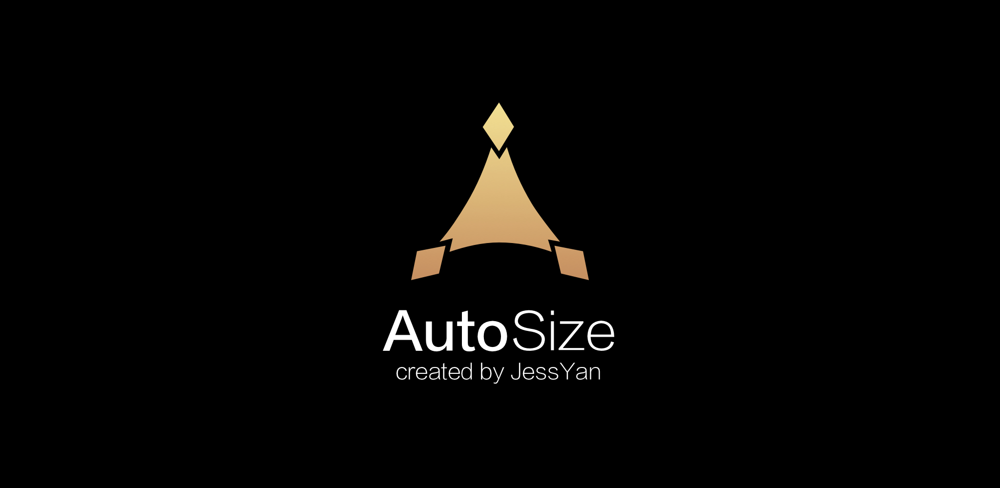


<p align="center">
   <a href="https://bintray.com/jessyancoding/maven/autosize/_latestVersion">
    
  </a>
  <a href="https://travis-ci.org/JessYanCoding/AndroidAutoSize">
    
  </a>
  <a href="https://developer.android.com/about/versions/android-4.0.html">
    
  </a>
  <a href="http://www.apache.org/licenses/LICENSE-2.0">
    
  </a>
  <a href="https://www.jianshu.com/u/1d0c0bc634db">
    
  </a>
  <a href="https://shang.qq.com/wpa/qunwpa?idkey=7e59e59145e6c7c68932ace10f52790636451f01d1ecadb6a652b1df234df753">
    
  </a>
</p>


## 今日头条屏幕适配方案终极版，一个极低成本的 Android 屏幕适配方案.


## Overview
### Pixel 2 XL | 1440 x 2880 | 560dpi:
<p>
   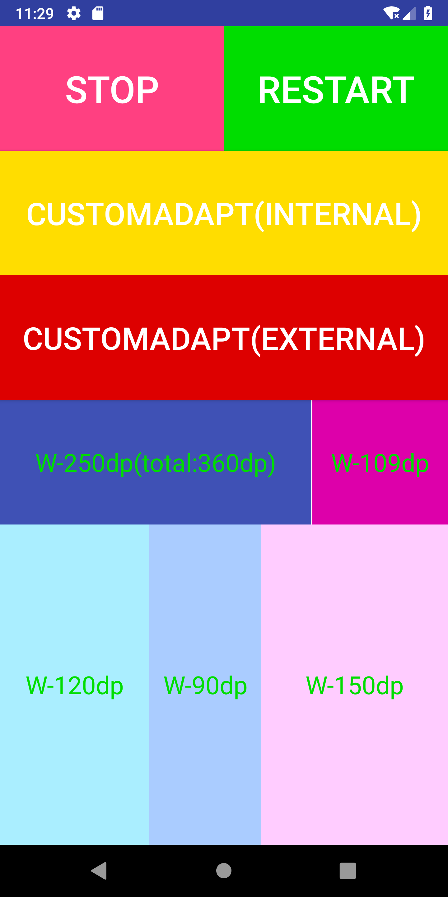
   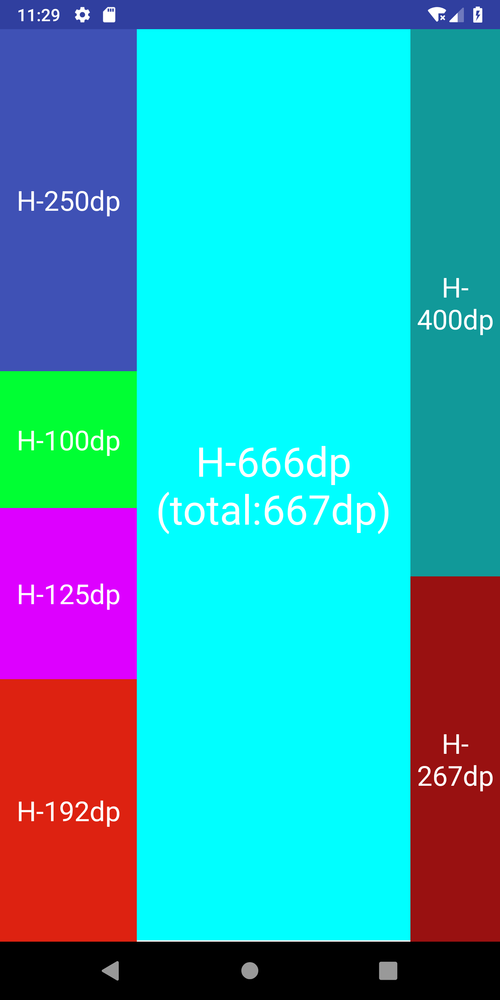
   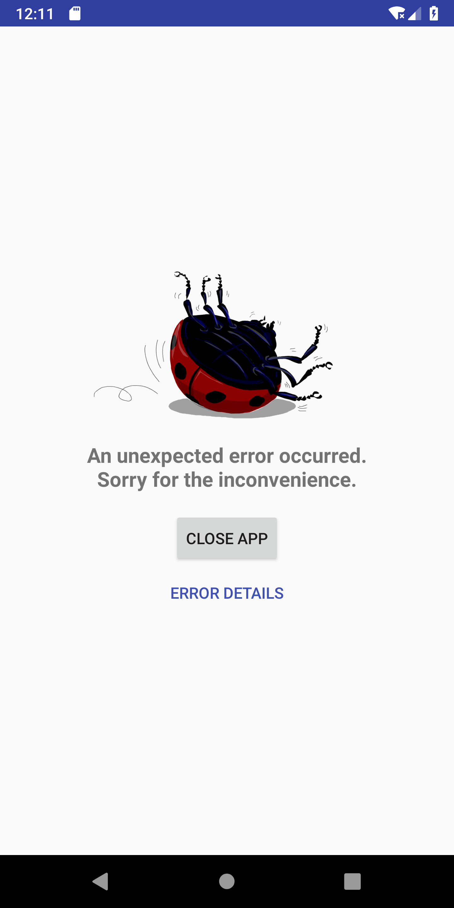
</p>

### Pixel XL | 1440 x 2560 | 560dpi:
<p>
   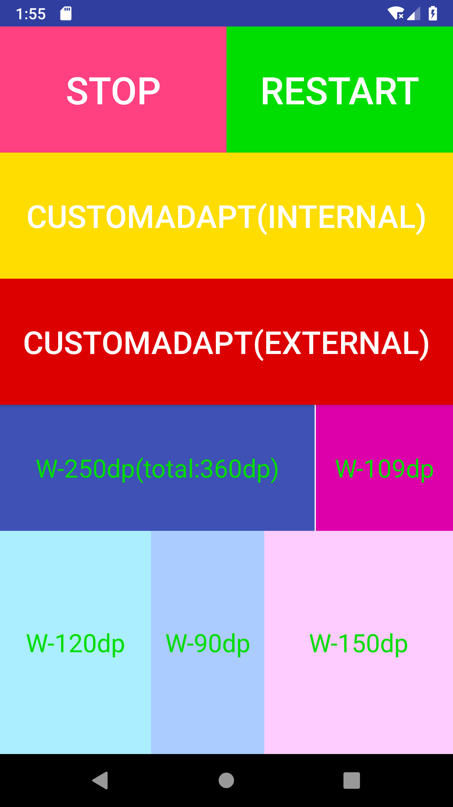
   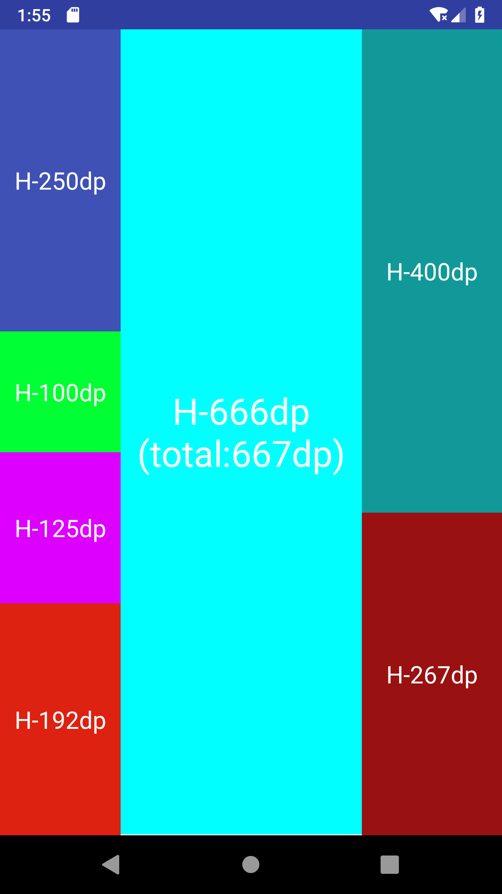
   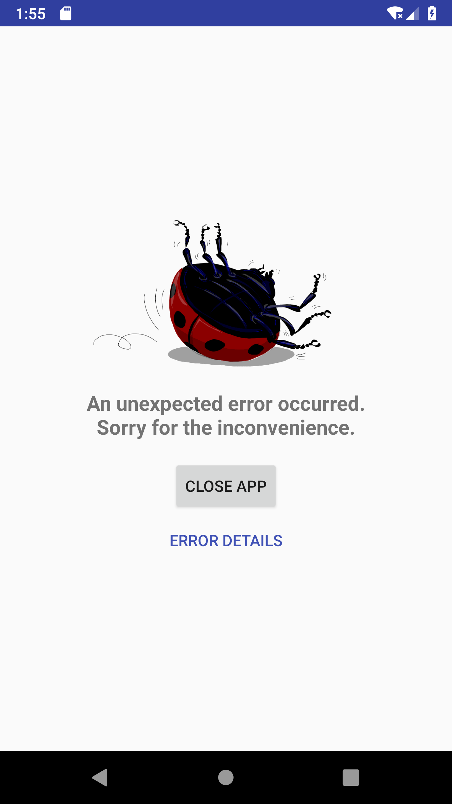
</p>

### Nexus 5X | 1080 x 1920 | 420dpi:
<p>
   
   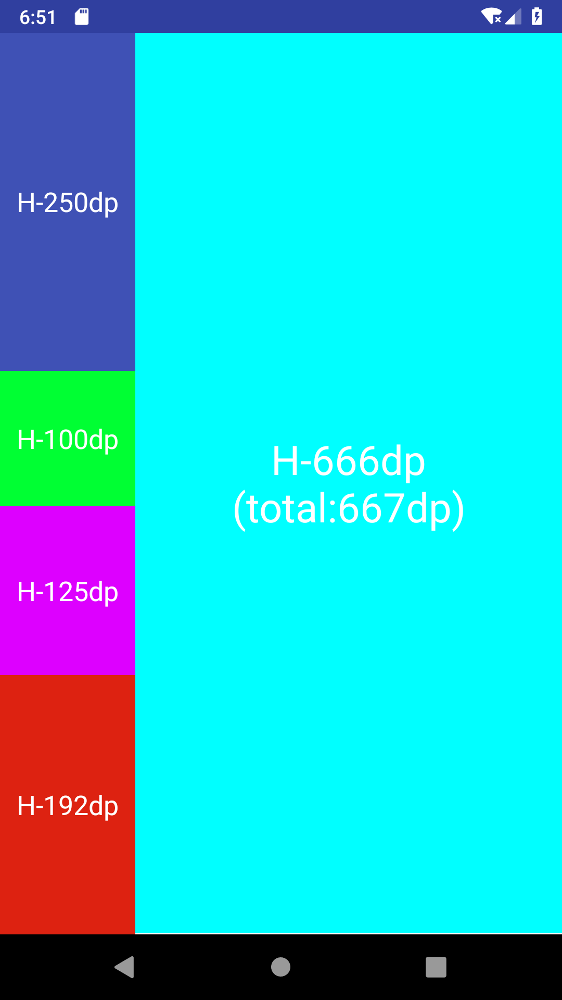
   
</p>

### Nexus 4 | 768 x 1280 | 320dpi:
<p>
   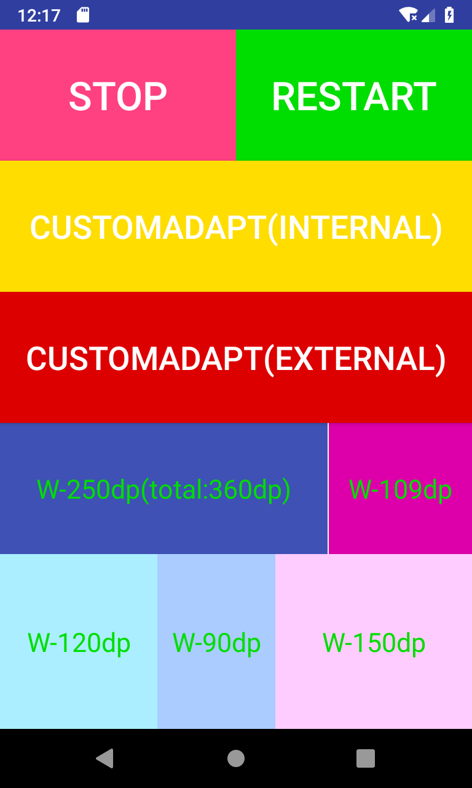
   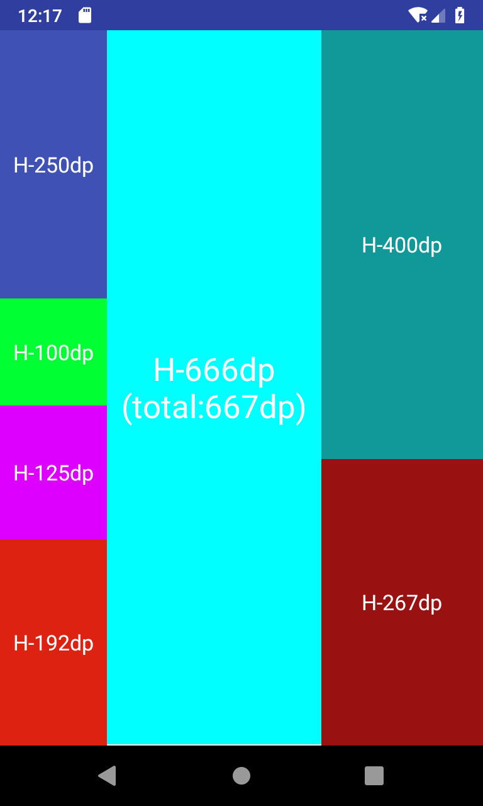
   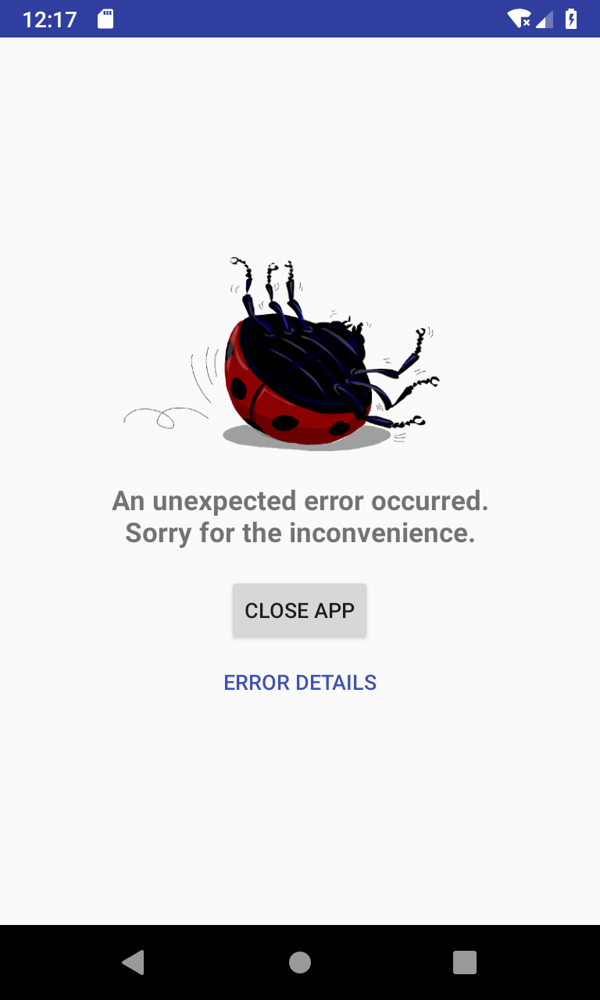
</p>

### Nexus S | 480 x 800 | 240dpi:
<p>
   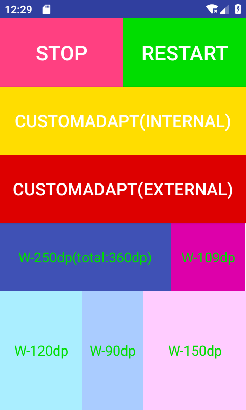
   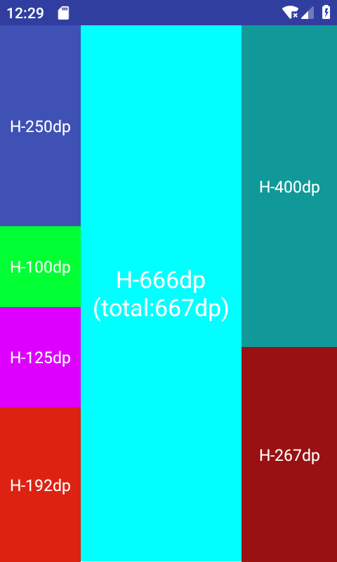
   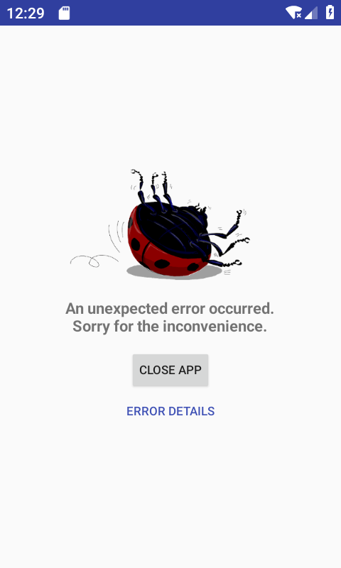
</p>

## Notice
* [主流机型设备信息，可以作为参考](https://material.io/tools/devices/)

* [功能介绍](https://juejin.im/post/5bce688e6fb9a05cf715d1c2)

* [原理分析](https://juejin.im/post/5b7a29736fb9a019d53e7ee2)

* [今日头条屏幕适配方案常见问题汇总](https://github.com/JessYanCoding/AndroidAutoSize/issues/13)

* [Android 进阶框架](https://github.com/JessYanCoding/MVPArms)

* 对于老项目，如果使用了 **AndroidAutoLayout**，请参考 [**AndroidAutoLayout** 迁移指南](https://github.com/JessYanCoding/AndroidAutoSize/issues/90)，**AndroidAutoSize** 可以和 [**AndroidAutoLayout**](https://github.com/hongyangAndroid/AndroidAutoLayout) 一起使用，因为 **AndroidAutoLayout** 使用的是 **px**，所以 **AndroidAutoSize** 对它不会产生任何影响，如果老项目的某些页面之前使用了 **dp** 进行布局，并且 **AndroidAutoSize** 对这些页面已经产生了不良影响，可以让之前使用了 **dp** 的旧 **Activity** 实现 **CancelAdapt** 取消适配，**建议使用副单位，使用副单位则不会影响之前使用了 dp 的页面 (也不会影响三方库和系统控件)，详情请查看 [demo-subunits](https://github.com/JessYanCoding/AndroidAutoSize/tree/master/demo-subunits)** 

## Download
``` gradle
 implementation 'me.jessyan:autosize:1.1.2'
```

## Usage
### Step 1 (真的不吹牛逼，只需要以下这一步，框架就可以对项目中的所有页面进行适配)
* **请在 AndroidManifest 中填写全局设计图尺寸 (单位 dp)，如果使用副单位，则可以直接填写像素尺寸，不需要再将像素转化为 dp，详情请查看 [demo-subunits](https://github.com/JessYanCoding/AndroidAutoSize/tree/master/demo-subunits)**
```xml
<manifest>
    <application>            
        <meta-data
            android:name="design_width_in_dp"
            android:value="360"/>
        <meta-data
            android:name="design_height_in_dp"
            android:value="640"/>           
     </application>           
</manifest>
```

<a name="preview"></a>
## Preview
* 布局时的实时预览在开发阶段是一个很重要的环节，很多情况下 **Android Studio** 提供的默认预览设备并不能完全展示我们的设计图，所以我们就需要自己创建模拟设备，下面就介绍下 **dp、pt、in、mm** 这四种单位的模拟设备创建方法

* 如果您在预览时不希望在 **Preview** 中出现状态栏和导航栏, 则可以根据下图选择 **panel** 主题，使用该主题后纵向分辨率刚好填充整个预览页面，显示效果完全和设计图一致
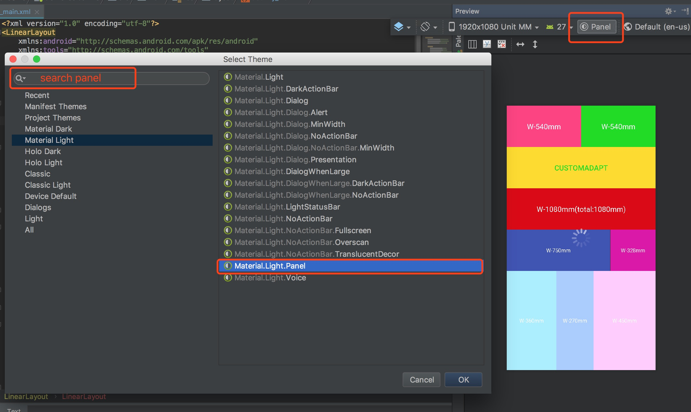

* 为了方便广大新手，所以还是将创建模拟设备的步骤贴出来，为大家操碎了心，如果觉得 **AndroidAutoSize** 不错，请一定记得 **star**，并将 **AndroidAutoSize** 推荐给您的伙伴们
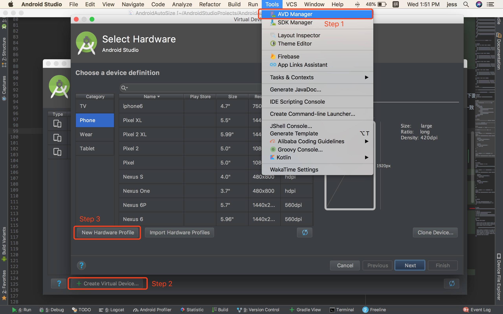

### DP
* 如果您在 **layout** 文件中使用 **dp** 作为单位进行布局 (**AndroidAutoSize** 默认支持 **dp、sp** 进行布局)，则可以根据公式 **(sqrt(纵向分辨率^2+横向分辨率^2))/dpi** 求出屏幕尺寸，然后创建模拟设备 (**只用填写屏幕尺寸和分辨率**)
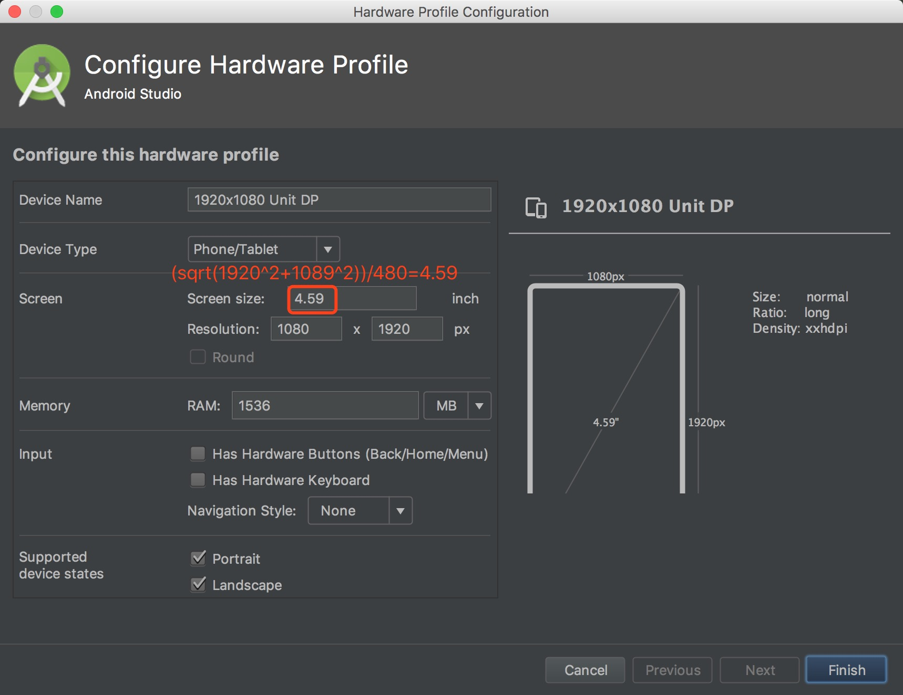

### PT
* 如果您在 **layout** 文件中使用 **pt** 作为单位进行布局 (需要通过 **AutoSizeConfig.getInstance().getUnitsManager().setSupportSubunits(Subunits.PT);** 打开对单位 **pt** 的支持)，则可以根据公式 **(sqrt(纵向分辨率^2+横向分辨率^2))/72** 求出屏幕尺寸，然后创建模拟设备 (**只用填写屏幕尺寸和分辨率**)


### IN
* 如果您在 **layout** 文件中使用 **in** 作为单位进行布局 (需要通过 **AutoSizeConfig.getInstance().getUnitsManager().setSupportSubunits(Subunits.IN);** 打开对单位 **in** 的支持)，则可以根据公式 **sqrt(纵向分辨率^2+横向分辨率^2)** 求出屏幕尺寸，然后创建模拟设备 (**只用填写屏幕尺寸和分辨率**)


### MM
* 如果您在 **layout** 文件中使用 **mm** 作为单位进行布局 (需要通过 **AutoSizeConfig.getInstance().getUnitsManager().setSupportSubunits(Subunits.MM);** 打开对单位 **mm** 的支持)，则可以根据公式 **(sqrt(纵向分辨率^2+横向分辨率^2))/25.4** 求出屏幕尺寸，然后创建模拟设备 (**只用填写屏幕尺寸和分辨率**)


## Advanced (以下用法看不懂？答应我，认真看 demo 好不好？)

### Activity
* **当某个 Activity 的设计图尺寸与在 AndroidManifest 中填写的全局设计图尺寸不同时，可以实现 CustomAdapt 接口扩展适配参数**
```java
public class CustomAdaptActivity extends AppCompatActivity implements CustomAdapt {

    @Override
    public boolean isBaseOnWidth() {
        return false;
    }

    @Override
    public float getSizeInDp() {
        return 667;
    }
}
```

* **当某个 Activity 想放弃适配，请实现 CancelAdapt 接口**
```java
public class CancelAdaptActivity extends AppCompatActivity implements CancelAdapt {

}
```

### Fragment
* **首先开启支持 Fragment 自定义参数的功能**
```java
AutoSizeConfig.getInstance().setCustomFragment(true);
```

* **当某个 Fragment 的设计图尺寸与在 AndroidManifest 中填写的全局设计图尺寸不同时，可以实现 CustomAdapt 接口扩展适配参数**
```java
public class CustomAdaptFragment extends Fragment implements CustomAdapt {

    @Override
    public boolean isBaseOnWidth() {
        return false;
    }

    @Override
    public float getSizeInDp() {
        return 667;
    }
}
```

* **当某个 Fragment 想放弃适配，请实现 CancelAdapt 接口**
```java
public class CancelAdaptFragment extends Fragment implements CancelAdapt {

}
```

### Subunits (请认真看 demo-subunits，里面有详细介绍)
* 可以在 **pt、in、mm** 这三个冷门单位中，选择一个作为副单位，副单位是用于规避修改 **DisplayMetrics#density** 所造成的对于其他使用 **dp** 布局的系统控件或三方库控件的不良影响，使用副单位后可直接填写设计图上的像素尺寸，不需要再将像素转化为 **dp**


```java
AutoSizeConfig.getInstance().getUnitsManager()
        .setSupportDP(false)
        .setSupportSP(false)
        .setSupportSubunits(Subunits.MM);
```

## About Me
* **Email**: <jess.yan.effort@gmail.com>
* **Home**: <http://jessyan.me>
* **掘金**: <https://juejin.im/user/57a9dbd9165abd0061714613>
* **简书**: <https://www.jianshu.com/u/1d0c0bc634db>

## License
```
 Copyright 2018, jessyan

   Licensed under the Apache License, Version 2.0 (the "License");
   you may not use this file except in compliance with the License.
   You may obtain a copy of the License at

       http://www.apache.org/licenses/LICENSE-2.0

   Unless required by applicable law or agreed to in writing, software
   distributed under the License is distributed on an "AS IS" BASIS,
   WITHOUT WARRANTIES OR CONDITIONS OF ANY KIND, either express or implied.
   See the License for the specific language governing permissions and
   limitations under the License.
```
